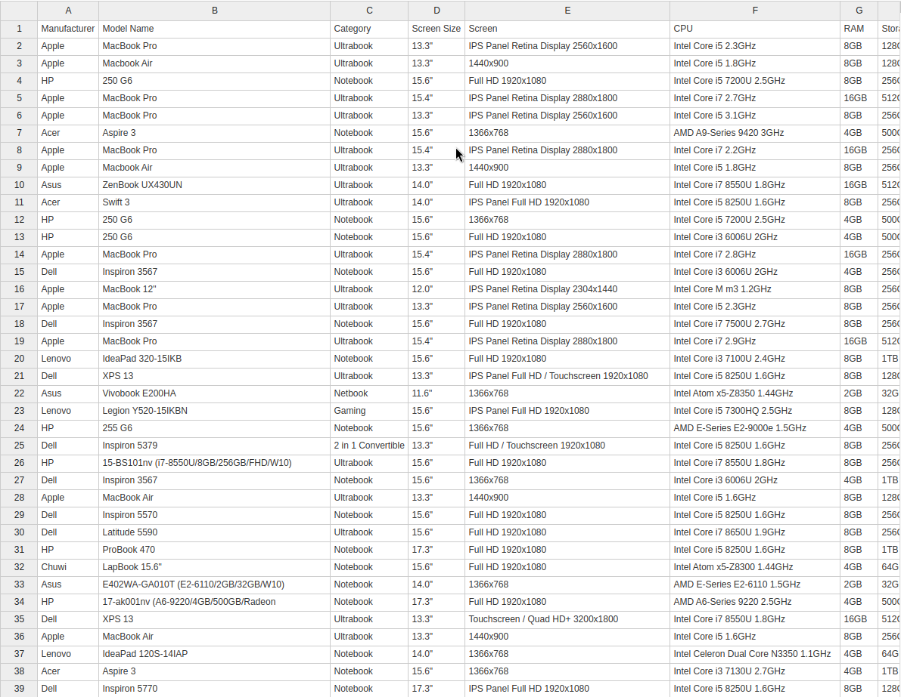
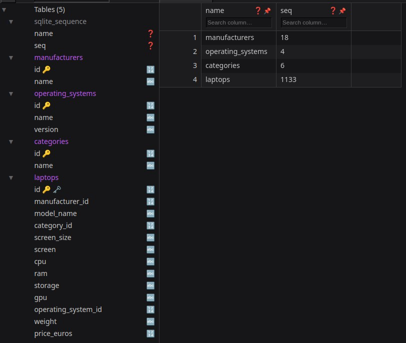

# Product Recommender Python Terminal App
 A basic CLI Product Recommender that uses a CLI conversational approach to narrow down user preferences for buying laptop.

### My Approach to Track Project Status:

| Task | Status |
|---|---|
| Define Basic Idea | Done |
| Set Up Github Repository | Done |
| Brainstorm Ideas into an Introduction File | Done |
| Gather Inventory Data for Recommendation | Done |
| Write Code | To Be Done |
| Refactor | To Be Done |
| Tidy Up Github Repo | To Be Done |
| Write a Post About It | To Be Done |

## Getting Started : Once Completed
1. Clone this repository.
2. Install the required Python libraries: `pip install -r requirements.txt`
3. Run the script: `python CSVtoNormalizedSQLiteDB.py` to ensure Inventory is populated from `raw_data`
3. Run the script: `python recommender.py`

### Expected User Story Steps:

1. **User opens the application.**
2. **The application greets the user and explains its purpose.**
3. **The application asks the user about their budget.**
4. **The user enters their budget.**
5. **The application asks the user about their preferred laptop use case (e.g., gaming, work, personal).**
6. **The user selects their preferred use case.**
7. **The application asks the user about their preferred laptop specifications.**
8. **The user enters their preferred specifications.**
9. **The application filters the laptop database based on the user's preferences and displays the results.**
10. **The user can refine their search by providing additional criteria.**
11. **The user can select a laptop to view more details.**
12. **The application provides detailed information about the selected laptop.**

### Tech Stack
``` 
Python
```

### Contributing:
Feel free to contribute to this project by submitting pull requests or raising issues.
Use code with caution.

### Getting and Cleaning Inventory Data for Use. 

**Laptop Inventory Data**

The script relies on a pre-defined database of laptops to provide recommendations. I've searched and identified a suitable dataset  from @37Degrees containing laptop specifications. 

https://github.com/37Degrees/DataSets/blob/master/laptops.csv

While this dataset is from 5 Years ago, having a structured data like the above would help focus on the application function and less on data clearning. This dataset will be used to populate the application's internal laptop inventory for the recommendation.

The downloaded CSV is inside ```raw_data/``` by the name ```laptops.csv``` folder

**CSV to SQLite Conversion:**

The raw CSV data has been converted into a SQLite database for efficient querying and filtering. This should improves the performance and scalability of the recommendation script. I created both a normalized DB version and a denormalized DB version. I may only use one for now. 

| Before Conversion | After Conversion |
|---|---|
|  |  |


